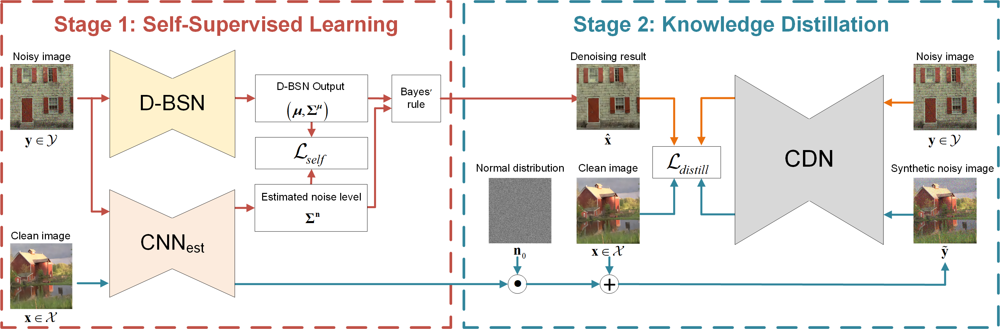
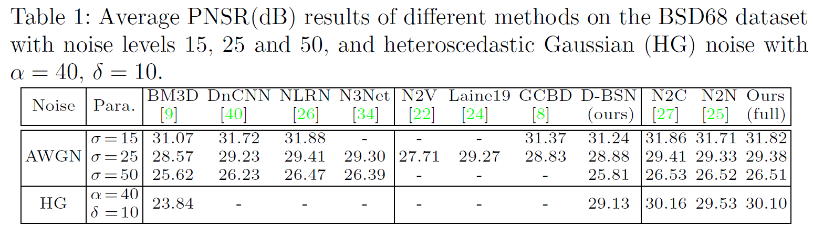
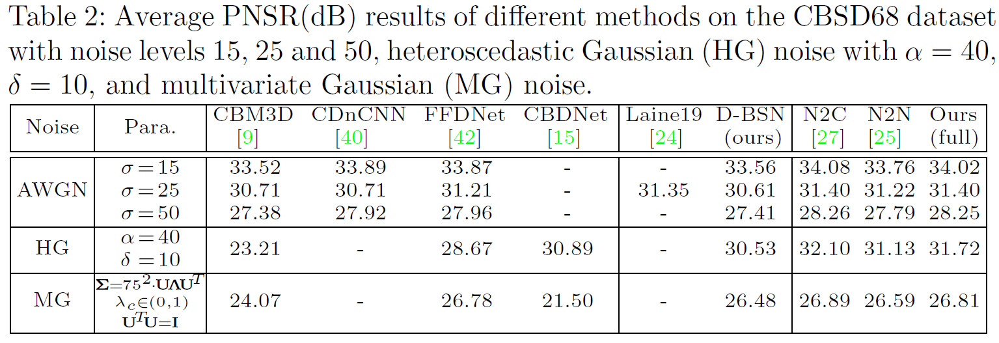

# DBSN

Official PyTorch implementation of [Unpaired Learning of Deep Image Denoising](http://www.ecva.net/papers/eccv_2020/papers_ECCV/papers/123490341.pdf).

We investigate the task of learning blind image denoising networks from an unpaired set of clean and noisy images.
Assuming that the noise can be signal dependent but is spatially uncorrelated, we present a two-stage scheme by incorporating self-supervised learning and knowledge distillation. 
For self-supervised learning, we suggest a dilated blind-spot network (D-BSN) to learn denoising solely from real noisy images. Due to the spatial independence of noise, we adopt a network by stacking 1 × 1 convolution layers to estimate the noise level map for each image. Both the D-BSN and image-specific noise model (CNN\_est) can be jointly trained via maximizing the constrained log-likelihood. Given the output of D-BSN and estimated noise level map,
improved denoising performance can be further obtained based on the Bayes’ rule. 
As for knowledge distillation, we first apply the learned noise models to clean images to synthesize a paired set of training images, and use the real noisy images and the corresponding denoising results in the first stage to form another paired set.


<p align="center">Illustration of our two-stage training scheme involving self-supervised learning and knowledge distillation.</p>


<p align="center">Mechanisms of BSNs</p>

## Preparation

- **Prerequisites**
    - PyTorch (v1.2 is recommended)
    - Python 3.x, with OpenCV, Numpy, Pillow, tqdm, matplotlib and tensorboardX
- **Datasets**
    - Download the original dataset and unzip the JPG/PNG/BMP/TIF... images to the dataset path with its default name, such as $Your_datasets_path/imagenet_val, $Your_datasets_path/bsd68 ...
    - We mainly use the ImageNet validation set for training. 
    - Due to the self-supervised learning, we also can use the validation datasets for training.
    - Add your datasets in ./data/__init__.py
    - Change the dataset path to yours in ./data/image_dataset.py
- **Pre-trained models**
    - Download the pre-trained models [GoogleDrive](https://drive.google.com/file/d/10KyDUGdfdHSssmPXpekZcZ7weOnpbYge/view?usp=sharing) to ./models/

## Training

On gray level images, we evaluate two basic noise models, i.e., AWGN and heteroscedastic Gaussian (HG). On color images, we evaluate three basic noise models, i.e., AWGN, heteroscedastic Gaussian (HG) and multivariate Gaussian (MG).

**AWGN**
    cd ./dbsn_gray
    python gray_train.py \
        --isTrain True \
        --noise_type gaussian \
        --val_noiseL 25 \
        --sigma_mu_middle_channel 16 \
        --sigma_n_middle_channel 16 \
        --patch_size 96

**HG**
    cd ./dbsn_gray
    python gray_train.py \
    --isTrain True \
    --noise_type poisson_gaussian \
    --val_noiseL 40 10 \
    --sigma_mu_middle_channel 32 \
    --sigma_n_middle_channel 32 \
    --patch_size 96

**MG**
    cd ./dbsn_color
    python rgb_train.py \
    --isTrain True \
    --noise_type multivariate_gaussian \
    --sigma_mu_output_channel 6 \
    --sigma_n_output_channel 6 \
    --patch_size 96

**Note**:
We suggest to pre-train μ first by using L2 Loss, then pre-train the σ_μ and σ_n by using the Pre-trained loss (./net/losses.py), finally fine-tune the whole framework especailly for HG&MG.

We evaluate the validation set after each epoch for getting reliable and optimal results during training (As an alternative, you also can save each epoch to evaluate after the training stage). 

Please adjust the batch size if you run out of memory. The pre-trained networks were trained on 1~2 GPUs. Refer to the corresponding *.sh for detailed parameters.

## Evaluating

We fix the random seeds to generate noisy images in evaluation mode. The evaluation results have been updated and should be better or comparable to the paper. 

Run directly for different noise types:

**AWGN**
    cd ./dbsn_gray
    python gray_test.py \
    --isTrain False \
    --valset bsd68 \
    --noise_type gaussian \
    --val_noiseL 25 \
    --last_ckpt ./models/gray_gaussian_nL25.pth

**HG**
    cd ./dbsn_gray
    python gray_test.py \
    --isTrain False \
    --valset bsd68 \
    --noise_type poisson_gaussian \
    --val_noiseL 40 10 \
    --sigma_mu_middle_channel 32 \
    --sigma_n_middle_channel 32 \
    --last_ckpt ./models/gray_poisson_gaussian_s40_c10.pth

**MG**
    cd ./dbsn_color
    python rgb_test.py \
    --isTrain False \
    --valset cbsd68 \
    --noise_type multivariate_gaussian \
    --sigma_mu_output_channel 6 \
    --sigma_n_output_channel 6 \
    --last_ckpt ./models/rgb_multivariate_gaussian.pth

## Results
More results can be found in the paper and supplementary material.





## Citation

```
@InProceedings{DBSN,
    title = {Unpaired Learning of Deep Image Denoising},
    author = {Wu, Xiaohe and Liu, Ming and Cao, Yue and Ren, Dongwei and Zuo, Wangmeng},
    booktitle = {European Conference on Computer Vision (ECCV)},
    year = {2020}
}
```